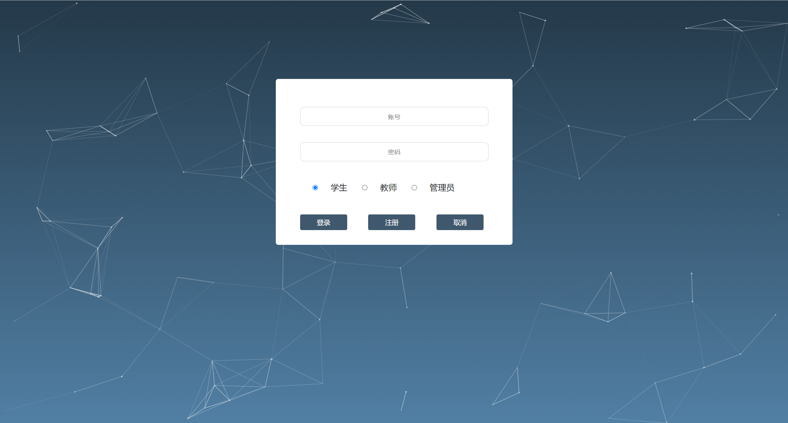
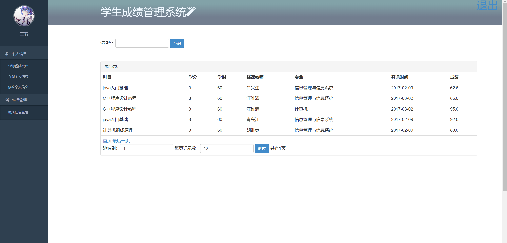
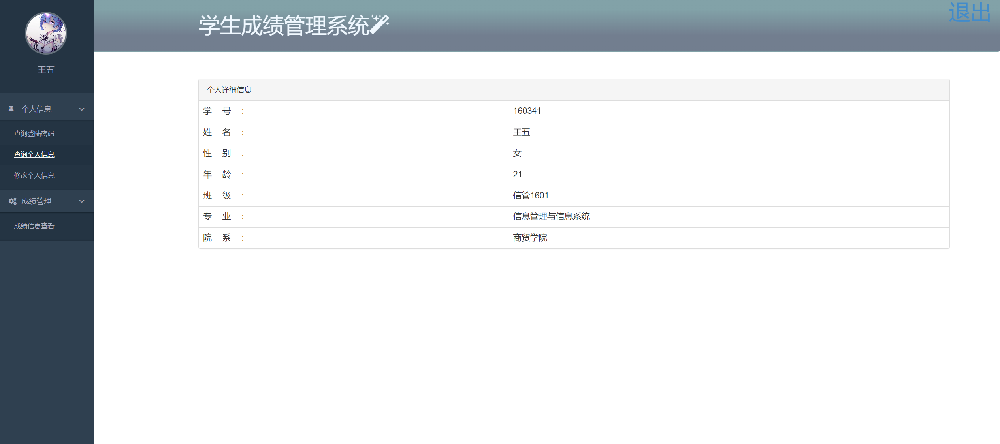
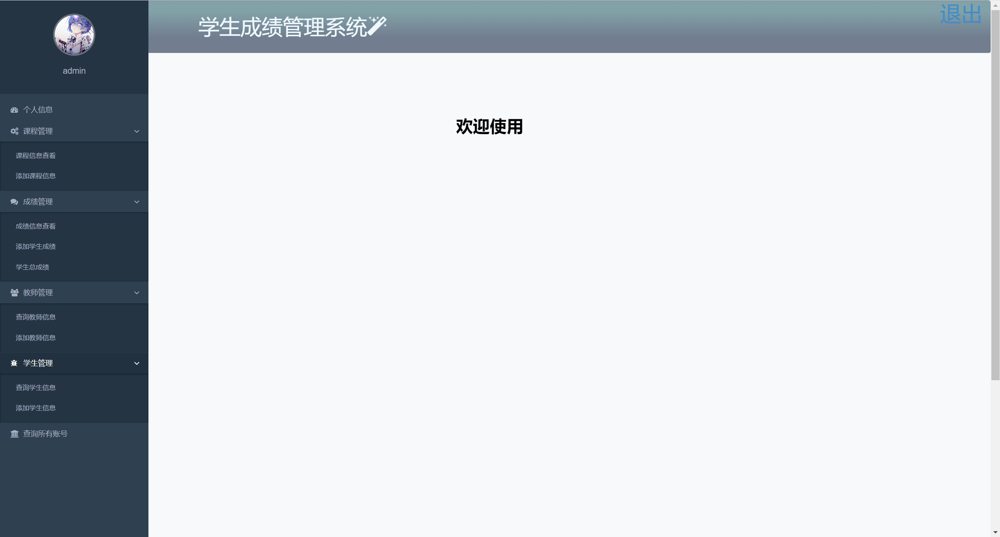
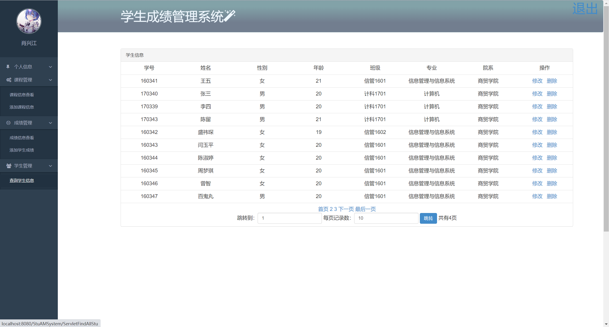
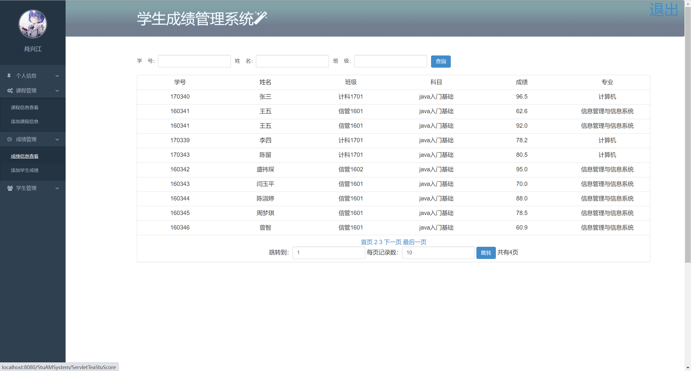
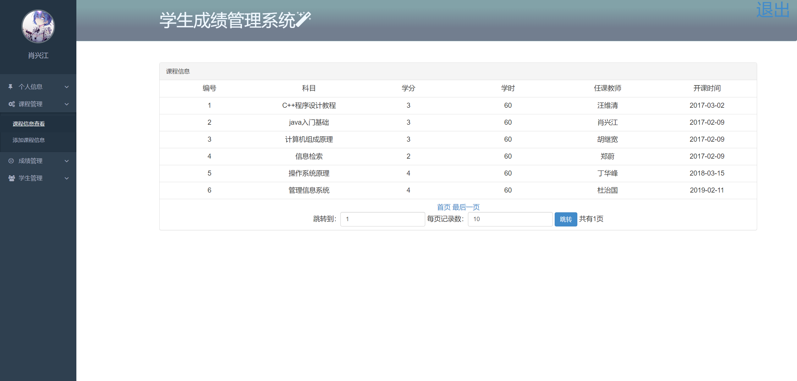
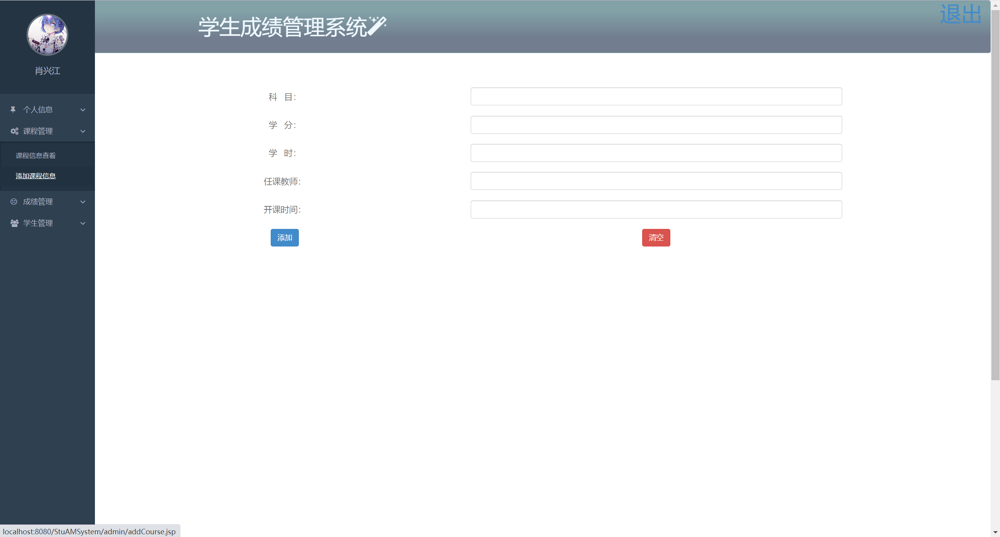
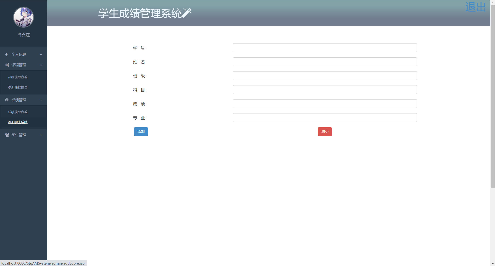

## 基于JSP+Servlet实现的学生成绩管理系统系统

###  获取sql数据库文件: 从戎源码网 (https://armycodes.com/) QQ: 386869957 QQ群: 377586148
###  所有系统地址: (https://github.com/YuLin-Coder/AllProjectCatalog) 
###  所有项目以及源代码本人均调试运行无问题 可支持远程安装部署调试、定制修改、代码讲解

## 项目介绍
基于JSP+Servlet实现的学生成绩管理系统系统，有学生、主要功能如下

【学生】
个人信息：查询登录密码、查询个人信息、修改个人信息
成绩管理：成绩信息查看

【教师】
课程管理：课程信息查看、添加课程信息
成绩管理：成绩信息查看、添加学生成绩
学生管理：查询学生信息

【管理员】
课程管理：课程信息查看、添加课程信息
成绩管理：成绩信息查看、添加学生成绩、学生总成绩
教师管理：查询教师信息、添加教师信息
学生管理：查询学生信息、添加学生信息
查询所有账号

## 项目技术
- 编程语言：Java
- 数据库：MySQL
- 前端技术：JSP、JavaScript、bootstrap、JQuery
- 后端技术：Servlet、JDBC

## 运行环境
- JDK版本：JDK1.8及以上
- 开发工具：IDEA、Ecplise、Myecplise都可以
- 数据库: MySQL5.7及以上

## 运行截图

